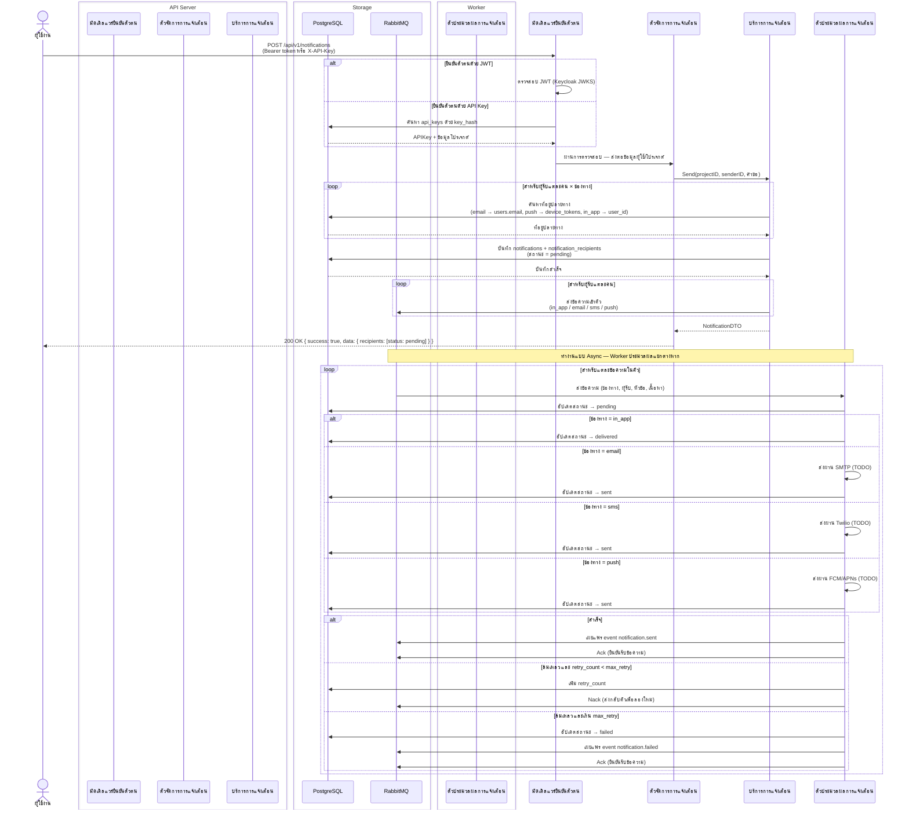
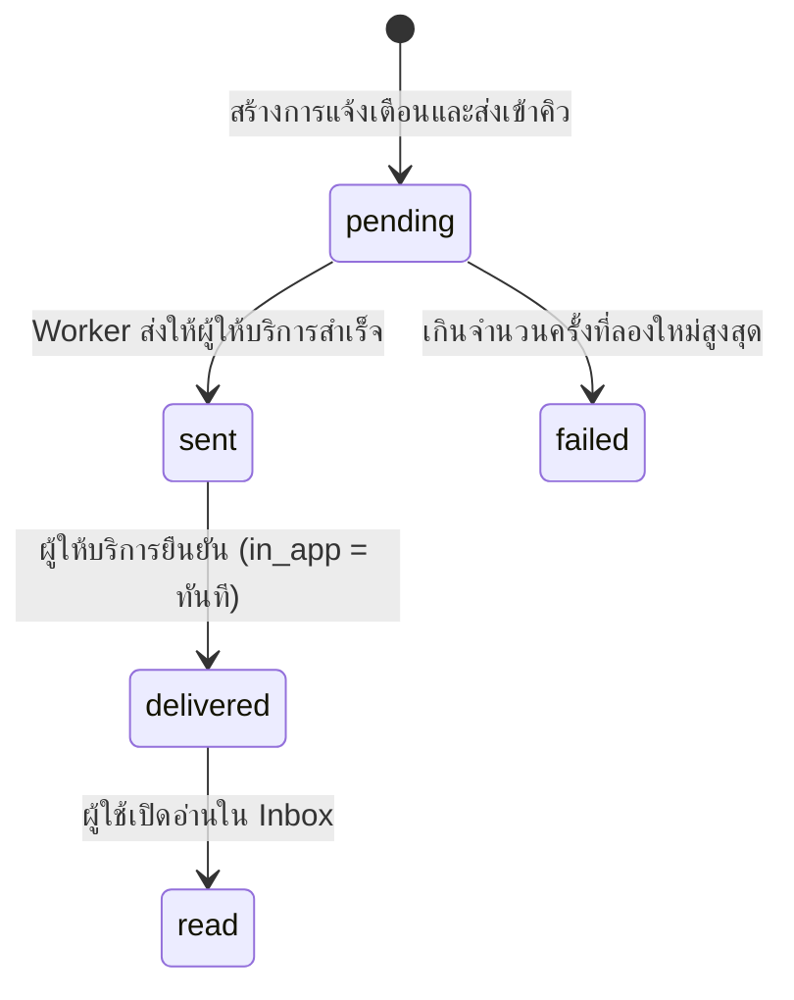
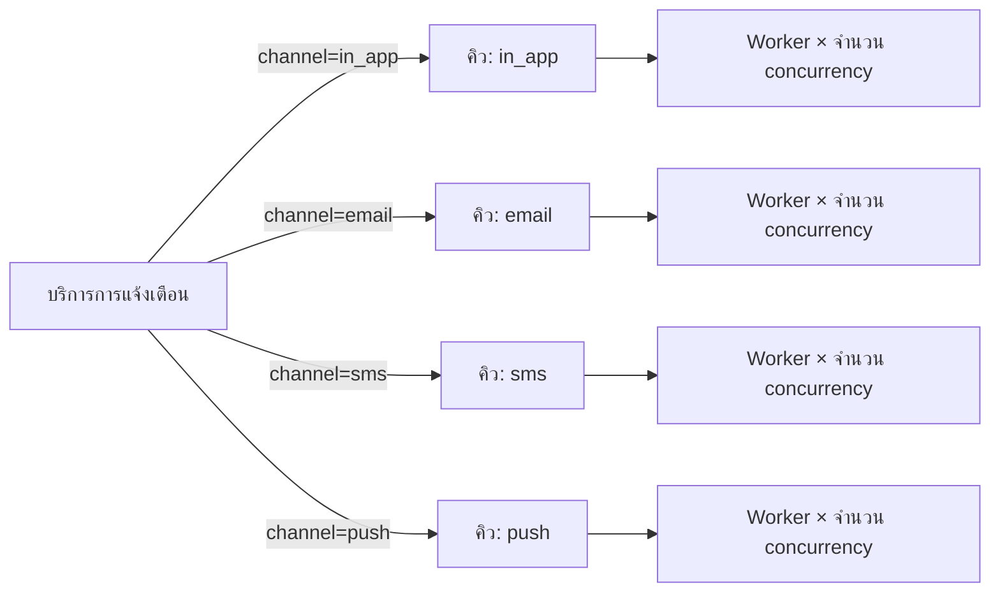

# 흐름การแจ้งเตือน (Notification Flow)

## แผนภาพลำดับเหตุการณ์

```mermaid
sequenceDiagram
    actor ผู้ใช้งาน

    box API Server
        participant AuthMiddleware as มิดเดิลแวร์ยืนยันตัวตน
        participant NotificationHandler as ตัวจัดการการแจ้งเตือน
        participant NotificationService as บริการการแจ้งเตือน
    end

    box Storage
        participant PostgreSQL
        participant RabbitMQ
    end

    box Worker
        participant NotificationWorker as ตัวประมวลผลการแจ้งเตือน
    end

    ผู้ใช้งาน->>มิดเดิลแวร์ยืนยันตัวตน: POST /api/v1/notifications<br/>(Bearer token หรือ X-API-Key)

    alt ยืนยันตัวตนด้วย JWT
        มิดเดิลแวร์ยืนยันตัวตน->>มิดเดิลแวร์ยืนยันตัวตน: ตรวจสอบ JWT (Keycloak JWKS)
    else ยืนยันตัวตนด้วย API Key
        มิดเดิลแวร์ยืนยันตัวตน->>PostgreSQL: ค้นหา api_keys ด้วย key_hash
        PostgreSQL-->>มิดเดิลแวร์ยืนยันตัวตน: APIKey + ข้อมูลโปรเจกต์
    end

    มิดเดิลแวร์ยืนยันตัวตน->>ตัวจัดการการแจ้งเตือน: ผ่านการตรวจสอบ — ส่งต่อข้อมูลผู้ใช้/โปรเจกต์

    ตัวจัดการการแจ้งเตือน->>บริการการแจ้งเตือน: Send(projectID, senderID, คำขอ)

    loop สำหรับผู้รับแต่ละคน × ช่องทาง
        บริการการแจ้งเตือน->>PostgreSQL: ค้นหาที่อยู่ปลายทาง<br/>(email → users.email, push → device_tokens, in_app → user_id)
        PostgreSQL-->>บริการการแจ้งเตือน: ที่อยู่ปลายทาง
    end

    บริการการแจ้งเตือน->>PostgreSQL: บันทึก notifications + notification_recipients<br/>(สถานะ = pending)
    PostgreSQL-->>บริการการแจ้งเตือน: บันทึกสำเร็จ

    loop สำหรับผู้รับแต่ละคน
        บริการการแจ้งเตือน->>RabbitMQ: ส่งข้อความเข้าคิว<br/>(in_app / email / sms / push)
    end

    บริการการแจ้งเตือน-->>ตัวจัดการการแจ้งเตือน: NotificationDTO
    ตัวจัดการการแจ้งเตือน-->>ผู้ใช้งาน: 200 OK { success: true, data: { recipients: [status: pending] } }

    Note over RabbitMQ, ตัวประมวลผลการแจ้งเตือน: ทำงานแบบ Async — Worker ประมวลผลแยกต่างหาก

    loop สำหรับแต่ละข้อความในคิว
        RabbitMQ->>ตัวประมวลผลการแจ้งเตือน: ส่งข้อความ (ช่องทาง, ผู้รับ, หัวข้อ, เนื้อหา)

        ตัวประมวลผลการแจ้งเตือน->>PostgreSQL: อัปเดตสถานะ → pending

        alt ช่องทาง = in_app
            ตัวประมวลผลการแจ้งเตือน->>PostgreSQL: อัปเดตสถานะ → delivered
        else ช่องทาง = email
            ตัวประมวลผลการแจ้งเตือน->>ตัวประมวลผลการแจ้งเตือน: ส่งผ่าน SMTP (TODO)
            ตัวประมวลผลการแจ้งเตือน->>PostgreSQL: อัปเดตสถานะ → sent
        else ช่องทาง = sms
            ตัวประมวลผลการแจ้งเตือน->>ตัวประมวลผลการแจ้งเตือน: ส่งผ่าน Twilio (TODO)
            ตัวประมวลผลการแจ้งเตือน->>PostgreSQL: อัปเดตสถานะ → sent
        else ช่องทาง = push
            ตัวประมวลผลการแจ้งเตือน->>ตัวประมวลผลการแจ้งเตือน: ส่งผ่าน FCM/APNs (TODO)
            ตัวประมวลผลการแจ้งเตือน->>PostgreSQL: อัปเดตสถานะ → sent
        end

        alt สำเร็จ
            ตัวประมวลผลการแจ้งเตือน->>RabbitMQ: เผยแพร่ event notification.sent
            ตัวประมวลผลการแจ้งเตือน->>RabbitMQ: Ack (ยืนยันรับข้อความ)
        else ล้มเหลว และ retry_count < max_retry
            ตัวประมวลผลการแจ้งเตือน->>PostgreSQL: เพิ่ม retry_count
            ตัวประมวลผลการแจ้งเตือน->>RabbitMQ: Nack (ส่งกลับคิวเพื่อลองใหม่)
        else ล้มเหลว และเกิน max_retry
            ตัวประมวลผลการแจ้งเตือน->>PostgreSQL: อัปเดตสถานะ → failed
            ตัวประมวลผลการแจ้งเตือน->>RabbitMQ: เผยแพร่ event notification.failed
            ตัวประมวลผลการแจ้งเตือน->>RabbitMQ: Ack (ยืนยันรับข้อความ)
        end
    end
```

## วงจรชีวิตของสถานะ

```mermaid
stateDiagram-v2
    [*] --> pending : สร้างการแจ้งเตือนและส่งเข้าคิว
    pending --> sent : Worker ส่งให้ผู้ให้บริการสำเร็จ
    sent --> delivered : ผู้ให้บริการยืนยัน (in_app = ทันที)
    pending --> failed : เกินจำนวนครั้งที่ลองใหม่สูงสุด
    delivered --> read : ผู้ใช้เปิดอ่านใน Inbox
```

## การกระจายงานตามช่องทาง

```mermaid
flowchart LR
    NS[บริการการแจ้งเตือน] -->|channel=in_app| Q1[คิว: in_app]
    NS -->|channel=email| Q2[คิว: email]
    NS -->|channel=sms| Q3[คิว: sms]
    NS -->|channel=push| Q4[คิว: push]

    Q1 --> W1[Worker × จำนวน concurrency]
    Q2 --> W2[Worker × จำนวน concurrency]
    Q3 --> W3[Worker × จำนวน concurrency]
    Q4 --> W4[Worker × จำนวน concurrency]
```
