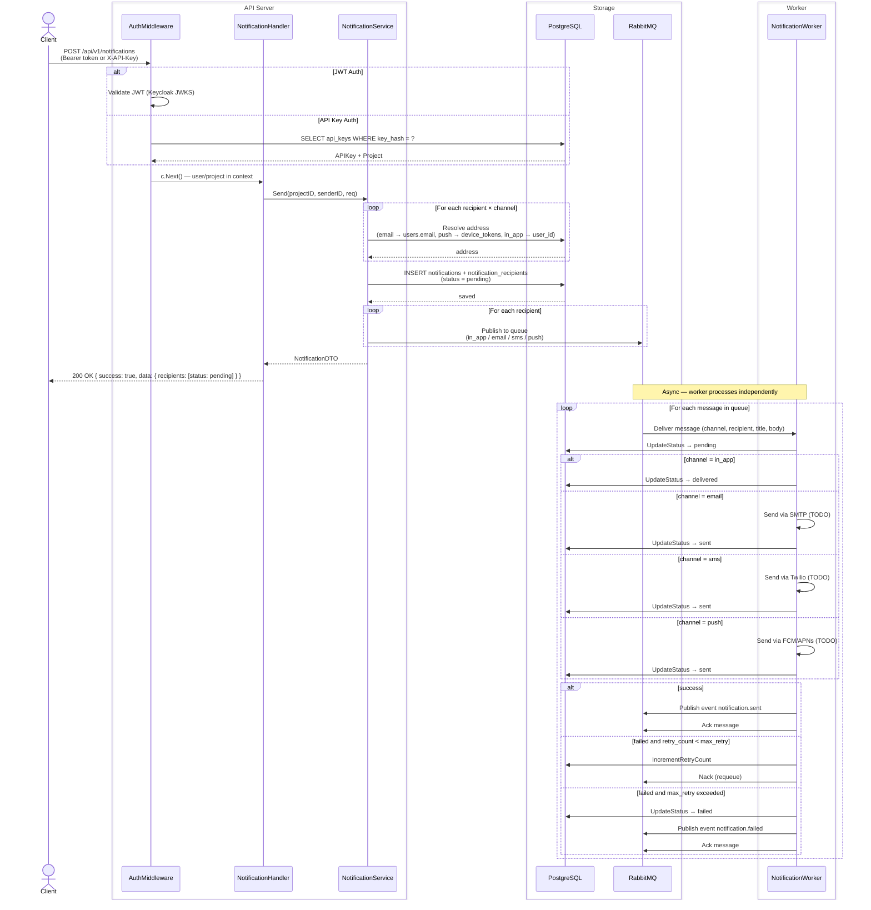
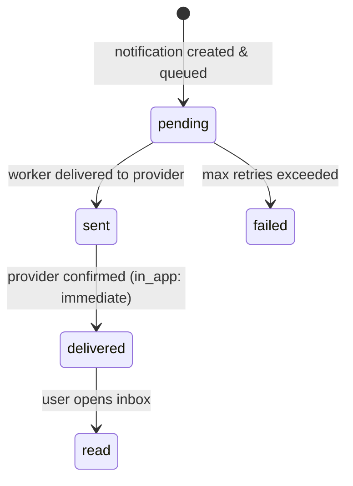
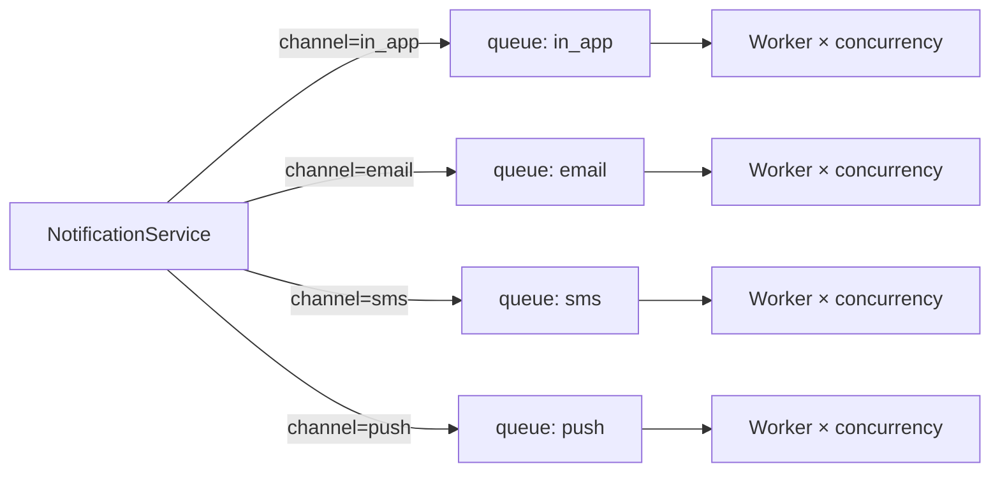

# Notification Flow

## Sequence Diagram

```mermaid
sequenceDiagram
    actor Client

    box API Server
        participant AuthMiddleware
        participant NotificationHandler
        participant NotificationService
    end

    box Storage
        participant PostgreSQL
        participant RabbitMQ
    end

    box Worker
        participant NotificationWorker
    end

    Client->>AuthMiddleware: POST /api/v1/notifications<br/>(Bearer token or X-API-Key)

    alt JWT Auth
        AuthMiddleware->>AuthMiddleware: Validate JWT (Keycloak JWKS)
    else API Key Auth
        AuthMiddleware->>PostgreSQL: SELECT api_keys WHERE key_hash = ?
        PostgreSQL-->>AuthMiddleware: APIKey + Project
    end

    AuthMiddleware->>NotificationHandler: c.Next() — user/project in context

    NotificationHandler->>NotificationService: Send(projectID, senderID, req)

    loop For each recipient × channel
        NotificationService->>PostgreSQL: Resolve address<br/>(email → users.email, push → device_tokens, in_app → user_id)
        PostgreSQL-->>NotificationService: address
    end

    NotificationService->>PostgreSQL: INSERT notifications + notification_recipients<br/>(status = pending)
    PostgreSQL-->>NotificationService: saved

    loop For each recipient
        NotificationService->>RabbitMQ: Publish to queue<br/>(in_app / email / sms / push)
    end

    NotificationService-->>NotificationHandler: NotificationDTO
    NotificationHandler-->>Client: 200 OK { success: true, data: { recipients: [status: pending] } }

    Note over RabbitMQ, NotificationWorker: Async — worker processes independently

    loop For each message in queue
        RabbitMQ->>NotificationWorker: Deliver message (channel, recipient, title, body)

        NotificationWorker->>PostgreSQL: UpdateStatus → pending

        alt channel = in_app
            NotificationWorker->>PostgreSQL: UpdateStatus → delivered
        else channel = email
            NotificationWorker->>NotificationWorker: Send via SMTP (TODO)
            NotificationWorker->>PostgreSQL: UpdateStatus → sent
        else channel = sms
            NotificationWorker->>NotificationWorker: Send via Twilio (TODO)
            NotificationWorker->>PostgreSQL: UpdateStatus → sent
        else channel = push
            NotificationWorker->>NotificationWorker: Send via FCM/APNs (TODO)
            NotificationWorker->>PostgreSQL: UpdateStatus → sent
        end

        alt success
            NotificationWorker->>RabbitMQ: Publish event notification.sent
            NotificationWorker->>RabbitMQ: Ack message
        else failed and retry_count < max_retry
            NotificationWorker->>PostgreSQL: IncrementRetryCount
            NotificationWorker->>RabbitMQ: Nack (requeue)
        else failed and max_retry exceeded
            NotificationWorker->>PostgreSQL: UpdateStatus → failed
            NotificationWorker->>RabbitMQ: Publish event notification.failed
            NotificationWorker->>RabbitMQ: Ack message
        end
    end
```

## Status Lifecycle

```mermaid
stateDiagram-v2
    [*] --> pending : notification created & queued
    pending --> sent : worker delivered to provider
    sent --> delivered : provider confirmed (in_app: immediate)
    pending --> failed : max retries exceeded
    delivered --> read : user opens inbox
```

## Queue Routing

```mermaid
flowchart LR
    NS[NotificationService] -->|channel=in_app| Q1[queue: in_app]
    NS -->|channel=email| Q2[queue: email]
    NS -->|channel=sms| Q3[queue: sms]
    NS -->|channel=push| Q4[queue: push]

    Q1 --> W1[Worker × concurrency]
    Q2 --> W2[Worker × concurrency]
    Q3 --> W3[Worker × concurrency]
    Q4 --> W4[Worker × concurrency]
```